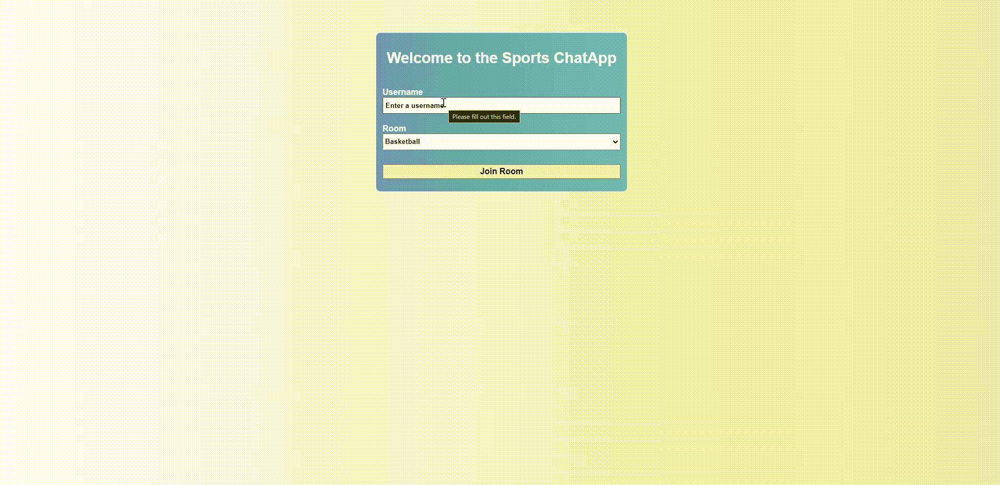

# SportsChatApp
A real time chat app which uses Node.js, Express.js and Socket.io. The chat app allows users to chat in different rooms about different sports. 

## How to run the SportsChatApp
```
Enter the directory and run:

npm run dev

Go to localhost:3000
```

## Demo 

